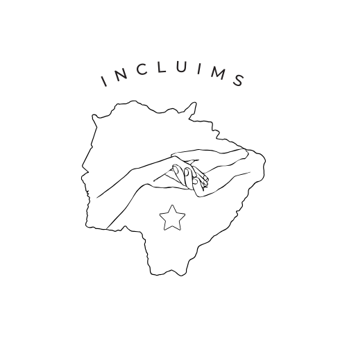

# INCLUIMS - Plataforma de Acessibilidade para Pessoas com Deficiência



[](https://opensource.org/licenses/MIT)
[](https://reactjs.org/)
[](https://www.typescriptlang.org/)
[](https://styled-components.com/)

## 📋 Sobre o Projeto

O INCLUIMS é uma plataforma web desenvolvida para centralizar informações relevantes sobre serviços, direitos, locais com acessibilidade e oportunidades para pessoas com deficiência física em Campo Grande - MS. 

O projeto busca preencher uma lacuna significativa no acesso à informação para este público, oferecendo uma interface acessível e adaptada às diferentes necessidades dos usuários.

### 🎯 Objetivo

Promover maior autonomia e inclusão social para pessoas com deficiência física através da democratização do acesso à informação relevante para o seu dia a dia.

## ✨ Funcionalidades

- **Mapa de Acessibilidade**: Localização georreferenciada de locais com acessibilidade em Campo Grande
- **Diretório de Serviços**: Catálogo organizado de serviços especializados para pessoas com deficiência
- **Banco de Informações Legais**: Repositório de legislação, direitos e políticas públicas em linguagem acessível
- **Fórum Comunitário**: Espaço para troca de experiências e suporte mútuo entre usuários
- **Notícias e Eventos**: Divulgação de informações atualizadas sobre inclusão e acessibilidade

## 📚 Glossário Técnico

Para padronizar a terminologia utilizada no projeto, adotamos as seguintes definições:

### Termos de Acessibilidade

- **Acessibilidade**: Qualidade do que é acessível; facilidade de acesso, de obtenção.
- **WCAG**: Web Content Accessibility Guidelines - Diretrizes de Acessibilidade para Conteúdo Web.
- **Tecnologia Assistiva**: Produtos, equipamentos ou sistemas que melhoram as capacidades funcionais de pessoas com deficiência.
- **Leitor de Tela**: Software que lê o conteúdo da tela para pessoas com deficiência visual.
- **Alto Contraste**: Modo de visualização que aumenta significativamente a diferença entre cores de fundo e primeiro plano.
- **Navegação por Teclado**: Uso do teclado (em vez do mouse) para navegar na interface.

### Tipos de Acessibilidade em Locais Físicos

- **Acessibilidade Física**: Características que permitem acesso e uso autônomo por pessoas com mobilidade reduzida.
  - **Rampa de Acesso**: Plano inclinado que substitui ou complementa escadas.
  - **Piso Tátil**: Piso com texturas em relevo para orientação de pessoas com deficiência visual.
  - **Banheiro Adaptado**: Banheiro com barras de apoio, espaço para manobra de cadeira de rodas e outras adaptações.

- **Acessibilidade Visual**: Recursos que facilitam o acesso de pessoas com deficiência visual.
  - **Braile**: Sistema de escrita tátil utilizado por pessoas cegas ou com baixa visão.
  - **Audiodescrição**: Narração adicional que descreve elementos visuais importantes.

- **Acessibilidade Auditiva**: Recursos para pessoas com deficiência auditiva.
  - **Libras**: Língua Brasileira de Sinais, utilizada pela comunidade surda brasileira.
  - **Legendagem**: Transcrição textual do conteúdo falado ou dos sons relevantes.

## 🚀 Tecnologias Utilizadas

- [React](https://reactjs.org/) - Biblioteca JavaScript para construção de interfaces
- [TypeScript](https://www.typescriptlang.org/) - Superset tipado de JavaScript
- [Styled Components](https://styled-components.com/) - Biblioteca para estilização de componentes
- [React Router](https://reactrouter.com/) - Navegação entre páginas
- [Axios](https://axios-http.com/) - Cliente HTTP para requisições
- [Leaflet](https://leafletjs.com/) - Biblioteca para mapas interativos
- [Jest](https://jestjs.io/) - Framework de testes

## 🔧 Requisitos de Sistema

- Node.js 18.x ou superior
- npm 9.x ou superior
- Navegador moderno compatível com ES6

## 📥 Instalação

Siga os passos abaixo para configurar o ambiente de desenvolvimento:

```bash
# Clone este repositório
git clone https://github.com/seu-usuario/incluims.git

# Acesse a pasta do projeto
cd incluims

# Instale as dependências
npm install

# Execute a aplicação em modo de desenvolvimento
npm start
```

A aplicação estará disponível em `http://localhost:3000`.

## 🔨 Estrutura do Projeto

```
/src
  /assets         # Imagens, ícones e recursos estáticos
  /components     # Componentes reutilizáveis
    /ui           # Componentes de interface (botões, inputs, etc)
    /layout       # Componentes estruturais (header, footer, etc)
    /features     # Componentes específicos de funcionalidades
  /contexts       # Contextos React para gerenciamento de estado
  /hooks          # Hooks personalizados
  /pages          # Componentes de página
  /services       # Serviços de API e integração externa
  /styles         # Estilos globais e temas
  /utils          # Funções utilitárias
  /types          # Definições de tipos TypeScript
```

## ♿ Acessibilidade

O INCLUIMS foi desenvolvido seguindo as diretrizes WCAG 2.1 nível AA, implementando:

- HTML semântico e estruturado
- Contraste adequado para elementos visuais
- Suporte completo à navegação por teclado
- Atributos ARIA para melhor interação com tecnologias assistivas
- Textos alternativos para conteúdo não-textual
- Temas de cores alternativos (modo escuro, alto contraste)
- Redimensionamento de texto sem perda de funcionalidade

## 🧪 Testes

O projeto utiliza Jest e React Testing Library para testes. Para executar os testes:

```bash
# Executar todos os testes
npm test

# Executar testes com cobertura
npm test -- --coverage
```

## 📝 Guia de Contribuição

Contribuições são bem-vindas! Para contribuir:

1. Faça um fork do projeto
2. Crie uma branch para sua feature (`git checkout -b feature/nova-funcionalidade`)
3. Implemente as mudanças e adicione testes quando aplicável
4. Execute os testes para garantir que tudo está funcionando
5. Commit suas alterações (`git commit -m 'Adiciona nova funcionalidade'`)
6. Push para a branch (`git push origin feature/nova-funcionalidade`)
7. Abra um Pull Request

Por favor, consulte o arquivo [CONTRIBUTING.md](./CONTRIBUTING.md) para mais detalhes sobre nosso código de conduta e processo de desenvolvimento.

## 📊 Roadmap

- **Versão 1.1** (Junho/2025)
  - Sistema de avaliação colaborativa de locais
  - Perfis de usuário personalizáveis
  
- **Versão 1.2** (Agosto/2025)
  - Integração com serviços públicos
  - Notificações personalizadas
  
- **Versão 2.0** (Dezembro/2025)
  - Aplicativo mobile nativo
  - Recursos de acessibilidade avançados

## 👥 Equipe

- **Thaysa Lacerda** - Desenvolvedora Frontend e Idealizadora

## 📜 Licença

Este projeto está licenciado sob a Licença MIT - veja o arquivo [LICENSE.md](./LICENSE.md) para detalhes.

## 📞 Contato

Para dúvidas, sugestões ou parcerias, entre em contato:

- Email: thaysarafaele@gmail.com

---

Desenvolvido com ❤️ em Campo Grande, MS - Brasil
